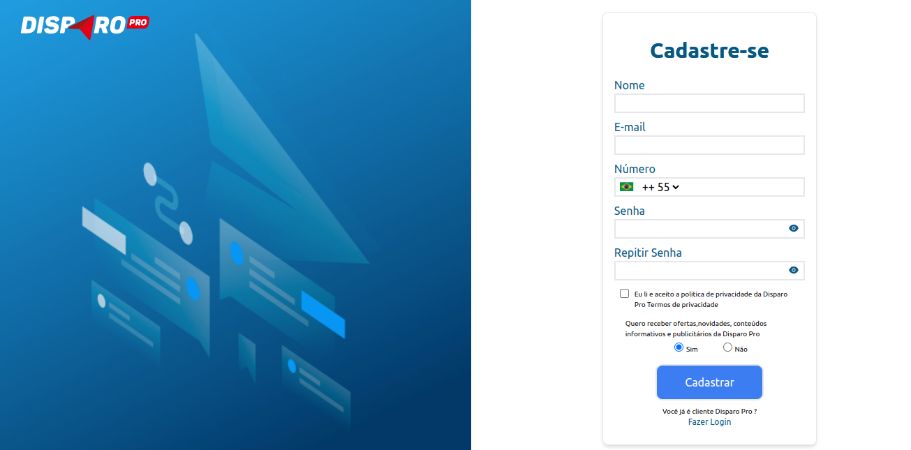

## Aplicação Front End Dispro

Execute o servidor:

```bash
npm run dev
# ou
yarn dev
```

Colocar no Navegador [http://localhost:3000/login](http://localhost:3000/login) 


Colocar no Navegador [http://localhost:3000/register](http://localhost:3000/register) 



Colocar no Navegador [http://localhost:3000/resetPassword](http://localhost:3000/resetPassword) 


